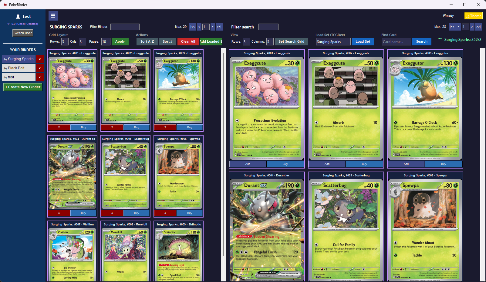
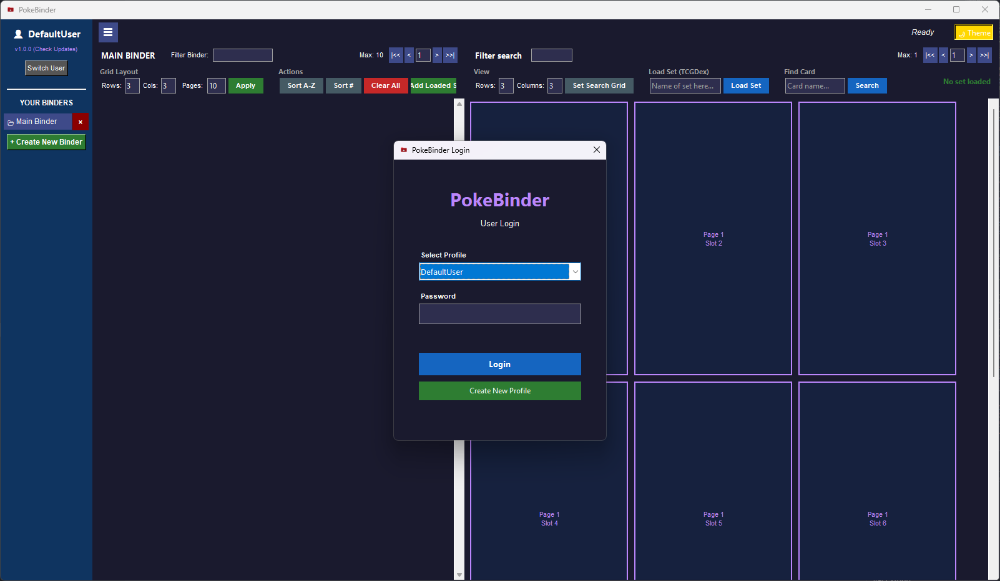

# PokeBinder

**PokeBinder** is a desktop application designed for Pokémon TCG collectors to digitally organize, visualize, and manage their card collections. It simulates the experience of a physical binder with drag-and-drop functionality, multi-user support, and allows users to purchase cards at the click of a button.


## 📸 Screenshots


*Manage your collection in the sleek Lunar (Dark) theme.*


*Switch to the Solar (Light) theme for a brighter look.*


*Secure user profiles with password protection.*

## ✨ Key Features

### 📚 Virtual Binder Management
*   **Drag & Drop Interface:** Move cards between slots and pages just like a real binder.
*   **Customizable Layouts:** Adjust rows, columns, and total pages per binder.
*   **Multi-Binder Support:** Create separate binders for different sets, trades, or decks.
*   **Smart Sorting:** Automatically sort your binder A-Z or by Card Number (e.g., #001, #002).
*   **Overflow Handling:** Cards that exceed the binder's capacity are labelled as Overflow, meaning they cannot fit the physical binder by the user's set parameters.

### 🔍 Advanced Search & Database
*   **TCGDex Integration:** Pulls data from the TCGDex API for accurate card images and set lists.
*   **Set Loading:** Load entire sets (e.g., "151", "Obsidian Flames") instantly.
*   **Smart Filtering:**
    *   **By Name:** Type "Pikachu" to find all matches.
    *   **By Number:** Type `#25` or `25` to find specific card numbers.
*   **Quick Add:** One-click button to add cards from search results to your active binder.

### 👤 User Profiles & Security
*   **Multi-User System:** Create multiple profiles on a single installation.
*   **Password Protection:** Secure your binders with a password.
*   **Privacy:** Binders are locked and hidden until the user authenticates.

### 🎨 Customization & UI
*   **Theme Support:** Toggle between **Solar (Light)** and **Lunar (Dark)** modes.
*   **Progress Tracking:** Real-time ticker showing collection completion percentage (e.g., "151: 120/165 (72.7%)") with color-coded status.
*   **Responsive Design:** The interface adjusts when you resize the window.

### 🛠️ Technical Features
*   **Auto-Updater:** Automatically checks GitHub for new releases and updates the app in-place.
*   **Offline Caching:** Caches card images locally to save bandwidth and speed up loading (with auto-cleanup).
*   **Data Persistence:** All data is saved locally in JSON format.

---

## 🚀 Installation

### Option 1: Standalone Executable (Recommended)
1.  Download the latest `PokeBinder.exe` from the [Releases](../../releases) page.
2.  Place it in a folder of your choice.
3.  Double-click to run. No Python installation required!

### Option 2: Running from Source
If you prefer to run the Python script directly:

1.  **Prerequisites:** Install Python 3.8+.
2.  **Clone the Repo:**
    ```bash
    git clone https://github.com/Mir-Khan/ptcg-binder-maker.git
    cd ptcg-binder-maker
    ```
3.  **Install Dependencies:**
    ```bash
    pip install requests pillow
    ```
4.  **Run the App:**
    ```bash
    python tcgapp.py
    ```

---

## 🎮 How to Use

1.  **Login/Register:** Create a new profile or log in with the default user (Password: `1234`).
2.  **Create a Binder:** Click `+ Create New Binder` in the side menu.
3.  **Load Cards:**
    *   Type a set name (e.g., "Crown Zenith") in the "Load Set" box and press Enter.
    *   OR search for a specific card (e.g., "Charizard") in the "Find Card" box.
4.  **Add Cards:** Click the **"Add"** button on a card in the search panel, or drag it into the binder.
5.  **Organize:** Drag cards around to rearrange them. Right-click a card to move it to a specific page.

---

## ⚙️ Configuration

### Environment Variables (Optional)
If you are building the app yourself, you can configure the update target:

*   `TCG_GITHUB_REPO`: The `username/repo` to check for updates.
*   `TCG_APP_VERSION`: The current version string.

### File Structure
The app creates the following files in its directory:
*   [tcg_data.json](http://_vscodecontentref_/1): Stores all user profiles and binder data. **Back this up!**
*   [card_cache](http://_vscodecontentref_/2): Stores downloaded card images.
*   [tcg_debug.log](http://_vscodecontentref_/3): Log file for troubleshooting.

---

## 🤝 Contributing

Contributions are welcome! Please feel free to submit a Pull Request.

1.  Fork the project.
2.  Create your feature branch (`git checkout -b feature/AmazingFeature`).
3.  Commit your changes (`git commit -m 'Add some AmazingFeature'`).
4.  Push to the branch (`git push origin feature/AmazingFeature`).
5.  Open a Pull Request.

---

## 📄 License

Distributed under the MIT License. See `LICENSE` for more information.

---

*Disclaimer: Pokémon and Pokémon Character Names are trademarks of Nintendo. This application is not affiliated with, endorsed, sponsored, or specifically approved by Nintendo, The Pokémon Company, or Game Freak.*